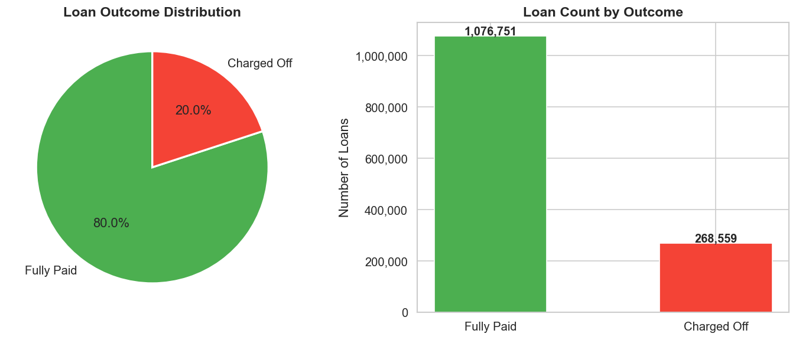

# Credit Risk Prediction — Lending Club (2007–2018)

Predicting consumer loan default on **1.34 million real loan records** using interpretable machine learning.  
**Stack**: Python · LightGBM · XGBoost · Optuna · SHAP · Scikit-learn · Streamlit · Pandas · Matplotlib

---

## Key Findings

> Results from the **2017–2018 out-of-time holdout** (225,611 loans the model never saw during training):

- **LightGBM ROC-AUC 0.7505 / KS 0.3571** on genuine future data — model discriminates good borrowers from bad across all operating thresholds, not just at a fixed cutoff
- **Optimal threshold t\* = 0.538** generates **$104.1M portfolio P&L** vs −$16.1M for approve-all and $101.1M for the default t = 0.50 — business value maximization adds $3M over the naïve threshold on a single cohort
- **SHAP confirms economically meaningful structure**: FICO tiers align precisely with Basel II / Dodd-Frank regulatory thresholds; DTI risk accelerates at 43%, matching the Qualified Mortgage rule; interest rate encodes adverse selection (Stiglitz & Weiss, 1981)
- **Fairness audit (EEOC 80% rule)**: small_business lower approval (48.9%) is risk-justified by 36.1% actual default rate — no unjustified disparate impact detected; debt_consolidation (DI = 0.80) flagged for monitoring
- **PSI monitoring**: all 15 top SHAP features stable (PSI < 0.10) in 2017–2018 — OOT performance decline is economic/policy structural shift, not feature drift

---

## Interactive Demo (Streamlit)

The pre-trained model (`lgbm_model.pkl`) is included in the repo — no dataset download or retraining required:

```bash
git clone https://github.com/proverb27515/credit_risk_lending.git
cd credit_risk_lending
pip install -r requirements.txt
streamlit run app.py
```

Enter loan amount, interest rate, FICO score, DTI, and other borrower details. The app returns:
- **Approve / Decline** decision at t\* = 0.538
- Probability gauge with threshold marker
- Risk tier (Low / Medium / High / Very High)
- **SHAP waterfall** showing the top 10 features driving that individual prediction

---

## Business Problem

The 2008 Global Financial Crisis demonstrated the systemic cost of mispriced credit risk. In its aftermath, regulators (Basel III, Dodd-Frank) and lenders shifted toward data-driven underwriting — replacing static rules with models that price risk at the individual borrower level.

This project builds a **pre-origination credit default model** using Lending Club's public loan data. Every feature is available *at the time of application* — no post-disbursement payment behavior is used, ensuring the model is deployment-realistic.

Three practical goals:
1. **Discriminate** good borrowers from bad before a loan is issued
2. **Interpret** predictions using SHAP to satisfy regulatory explainability requirements
3. **Validate** model logic against established economic theory — confirming the model has learned real credit risk structure, not statistical artifacts

---

## Dataset

| Property | Value |
|---|---|
| Source | [Lending Club Loan Data — Kaggle](https://www.kaggle.com/datasets/wordsforthewise/lending-club) |
| Period | 2007 Q1 – 2018 Q4 |
| Raw rows | ~1.8M loans, 151 features |
| After filtering | Closed loans only (Fully Paid + Charged Off): **1,348,059 loans** |
| Default rate | 19.98% — moderate class imbalance |
| Target | `1` = Charged Off (default), `0` = Fully Paid |

---

## Methodology

```
Raw Data: 1.8M rows, 151 features
    ↓ Filter: keep Fully Paid + Charged Off → 1,348,059 loans
    ↓ Drop: leakage columns, >50% missing fields, free-text
    ↓ Engineer: 5 new features (loan_to_income, installment_to_income, etc.)
    ↓ Encode: 12 categorical features via Label Encoding
    ↓ Impute: remaining NaN → column median
    ↓ Split: temporal — train on 2007–2016 (1,122,448), test on 2017–2018 (225,611)
    ↓
    Logistic Regression (balanced weights) → baseline AUC: 0.7334
    Optuna (50 trials, TPE, 10% subsample) → XGBoost best params
    Optuna (50 trials, TPE, 10% subsample) → LightGBM best params
    ↓ Retrain both on full training set with best params
    ↓
    SHAP TreeExplainer → global importance (beeswarm) + dependence plots
    KS Statistic → banking-standard score separation metric
    Optimal threshold → expected portfolio P&L maximization
    Fairness audit → EEOC 80% disparate impact rule
    PSI → feature drift monitoring across train/test windows
```

### Why These Three Models

| Model | Rationale |
|---|---|
| **Logistic Regression** | The traditional credit scorecard model. Interpretable, auditable, preferred by regulators under Basel II. Sets a principled performance baseline. |
| **XGBoost** | Captures non-linear risk interactions that logistic regression cannot (e.g., DTI risk is convex above a threshold). Handles missing values natively. Industry standard for tabular credit data. |
| **LightGBM** | Leaf-wise splitting is 3–5× faster than XGBoost on 1M+ rows with comparable AUC. In production, retraining frequency is an engineering constraint — LightGBM's speed is a real operational consideration. |

### Hyperparameter Tuning with Optuna

Bayesian optimization (TPE sampler), 50 trials per model, search on 10% subsample (~107K loans) to reduce runtime from hours to minutes. Best parameters then applied to the full 1.07M-loan training set for final evaluation.

**Parameters tuned**: `n_estimators`, `max_depth`, `learning_rate`, `subsample`, `colsample_bytree`, `reg_alpha`, `reg_lambda` + model-specific: `min_child_weight`, `gamma` (XGBoost); `num_leaves`, `min_child_samples` (LightGBM).

---

## Feature Engineering

Raw features cleaned and augmented with five engineered variables:

| Feature | Construction | Economic rationale |
|---|---|---|
| `loan_to_income` | `loan_amnt / (annual_inc + 1)` | Leverage ratio — obligation size relative to annual earnings |
| `installment_to_income` | `installment / (annual_inc / 12 + 1)` | Monthly cash flow burden — more direct repayment stress measure than DTI alone |
| `credit_history_months` | Months from `earliest_cr_line` to `issue_d` | Duration of demonstrated credit management |
| `term_months` | Parsed from `term` string | Numeric loan duration (36 or 60 months) |
| `emp_length_yrs` | Parsed from `emp_length` string | Income stability proxy |

**Dropped features**: 18 post-origination columns (payment history, recovery amounts) to prevent target leakage; 40+ joint application fields (>50% missing); free-text fields (url, desc, emp_title).

---

## EDA: Key Patterns

### Class Imbalance



~20% of closed loans were charged off. This moderate imbalance guided key modeling decisions: `scale_pos_weight` in XGBoost, `class_weight='balanced'` in LightGBM, and the use of **ROC-AUC and Average Precision** over accuracy as evaluation metrics.

---

### Default Rate Across Economic Cycles


The chart shows observed default rates among **closed loans only** (Fully Paid or Charged Off), which introduces **vintage truncation bias**:

- **2016–2017 show the highest observed rates (23%)** — the dataset ends Q4 2018, so still-performing 2016–2017 loans have not closed and are absent from the denominator. Closed loans from these vintages are disproportionately early defaulters, inflating the observed rate.
- **2009–2011 rates (14–15%) reflect true seasoned defaults** — by 2018, virtually all those loans had resolved, making the denominator complete.
- **2018 (15.7%) is artificially low** for the same truncation reason.

For **fully seasoned vintages**, default rates were relatively stable at 14–20% throughout the platform's history. The late-vintage spike is a dataset artifact.

---

### Lending Club's Grade System: Useful, But Insufficient


Grade A → G correctly ranks default rates from ~5% to ~35%. However, even Grade A carries ~5% default risk — a borrower-level model capturing within-grade variation is exactly where ML adds value over traditional scorecards.

---

### Loan Purpose as a Structural Risk Signal


- **Small business loans** carry the highest default rate (~27%), consistent with U.S. SBA data showing ~50% of small businesses fail within 5 years
- **Debt consolidation** — the most common purpose — sits near average, reflecting a heterogeneous borrower pool
- **Credit card refinancing** shows relatively lower risk, likely due to self-selection by credit-aware borrowers

This illustrates **adverse selection by loan purpose**: borrowers with the most urgent credit need are systematically higher risk.

---

## Model Results

Evaluated on **225,611 loans originated 2017–2018** (out-of-time holdout). The test set carries a slightly higher default rate (21.28% vs 19.72% in training), reflecting Lending Club's credit quality trajectory in its late expansion phase.

| Model | ROC-AUC | Avg Precision |
|---|---|---|
| Logistic Regression (baseline) | 0.7334 | 0.4772 |
| XGBoost + Optuna | 0.7496 | 0.5030 |
| **LightGBM + Optuna** | **0.7505** | **0.5045** |

**KS Statistic (LightGBM): 0.3571**

**Interpreting the numbers:**

- **OOT gap vs random-split**: AUC is ~0.015 lower than random-split benchmarks — the expected cost of genuine temporal holdout evaluating on a different economic cycle and underwriting vintage
- **LR → tree model (+0.017 AUC)**: Confirms non-linear credit risk structure that persists out-of-time, validating that tree models learned genuine risk rather than overfitting the training period
- **XGBoost vs LightGBM (0.001 AUC)**: Essentially identical predictive power; **LightGBM's 3–5× training speed** is the decisive factor for production deployments requiring frequent retraining
- **KS = 0.3571**: Above 0.30 is acceptable in consumer banking; above 0.40 is strong — the remaining gap reflects the limitation of public-source data vs. proprietary bureau data


---

## Business Insights

### SHAP: What the Model Learned


**Interest Rate — Adverse Selection in Action**

Interest rate is the strongest default predictor, but the mechanism is not direct causation. Lending Club sets rates based on perceived borrower risk, so interest rate already encodes the platform's risk assessment. This reflects a classic **adverse selection loop** (Stiglitz & Weiss, 1981): riskier borrowers accept high-rate loans that lower-risk borrowers reject, confirming their riskiness.

**FICO Score — Validated Against Regulatory Credit Tiers**

FICO has a strongly negative SHAP effect across all borrowers. The model's behavior aligns with established regulatory tiers:
- FICO < 620 (subprime): Sharp SHAP spike — highest marginal risk
- FICO 620–679 (near-prime): Transitional, moderate risk
- FICO ≥ 720 (prime): Near-zero or negative SHAP contribution

Alignment with Basel II regulatory definitions confirms the model has learned **economically meaningful credit risk structure**.

**DTI — Empirical Support for the Dodd-Frank Threshold**

Under **Dodd-Frank's Ability-to-Repay rule**, DTI > 43% is the regulatory threshold for "qualified mortgage" status. Our SHAP analysis confirms that the same threshold region is where DTI contributions to default risk accelerate — providing empirical validation of regulatory intuition using market data.

**Sub-Grade — The Value of Granularity**

Lending Club's sub-grade (A1–G5, 35 risk buckets) carries substantial SHAP values beyond what the main grade captures. Lenders pricing only at the grade level are leaving risk information on the table.

**Credit History Length — A Survivorship Effect**

Longer credit history reduces default probability through **survivorship**: borrowers who have maintained accounts for years without defaulting have passed an implicit endurance test.

---

### Optimal Decision Threshold

A model score is not a lending decision. The default 0.5 threshold implicitly assumes False Positive (reject good borrower) costs the same as False Negative (approve bad borrower). In consumer credit, this is incorrect by 3.8×:

| Error type | Business consequence | Estimated cost |
|---|---|---|
| False Negative (approve bad loan) | Default loss after recovery | avg **$13,628** per loan |
| False Positive (reject good loan) | Foregone interest income | avg **$3,594** per loan |

We sweep all thresholds 0.01–0.99 and compute expected portfolio P&L using actual `loan_amnt` and `int_rate` from the 2017–2018 test set:


| Threshold | Portfolio P&L | Approval Rate |
|---|---|---|
| Approve all (no model) | −$16.1M | 100% |
| Default t = 0.50 | $101.1M | ~75% |
| **Optimal t\* = 0.538** | **$104.1M** | **69.5%** |

The optimal threshold is **t\* = 0.538** — slightly above 0.5, reflecting the asymmetric cost structure. Against approve-all, the model adds **$120.2M** in avoided losses on this cohort alone.


---

### Probability Calibration

Calibration asks: *when the model predicts 30% default risk, do approximately 30% of those borrowers actually default?*

| Metric | Value | Interpretation |
|---|---|---|
| Brier Score | 0.1933 | Mean squared error of probability forecasts |
| Naive baseline | 0.1675 | Brier score of always predicting the base rate (21.3%) |
| Brier Skill Score | −0.15 | Model probabilities are less accurate than the baseline |


The negative Brier Skill Score reveals that while the model **discriminates** well (AUC = 0.75), its **predicted probabilities are inflated** — a known side effect of `class_weight='balanced'`. The model ranks correctly but overstates absolute default probability.

For rank-ordering and threshold decisions (approve/reject), AUC is the correct metric and the model performs well. For **risk-based pricing** where raw probability directly determines interest rate, a calibration step (Platt scaling or isotonic regression) would be required before deployment.

---

### Fairness & Disparate Impact Analysis

US credit regulation (ECOA, Fair Housing Act) prohibits lending models that produce **disparate impact** on protected groups. We apply the **EEOC 80% rule**: approval rate below 80% of the best-approved group triggers a flag, then cross-validated against actual default rates.


| Purpose | Approval Rate | Default Rate | DI Ratio | Assessment |
|---|---|---|---|---|
| car | 82.4% | 15.5% | 1.00 (ref) | Low risk, high approval |
| credit_card | 75.3% | 18.4% | 0.91 | Acceptable |
| **debt_consolidation** | **65.7%** | **22.3%** | **0.80** | Borderline — warrants monitoring |
| **small_business** | **48.9%** | **36.1%** | **0.59** | Below DI threshold, risk-justified |

`small_business` falls below the 0.80 DI threshold, but its 36.1% actual default rate — more than twice the portfolio average — confirms the disparity is **risk-driven, not arbitrary**. `debt_consolidation` (DI = 0.80, borderline) merits monitoring against protected-class proxies in a full fair lending audit.

---

### Feature Distribution Drift (PSI)

**Population Stability Index (PSI)** is the banking standard for monitoring whether a deployed model's input features have shifted between training and scoring windows.


All 15 top SHAP features show **PSI < 0.10** (stable), with the highest being `mo_sin_old_rev_tl_op` at 0.090. The 2017–2018 borrower population is statistically similar to the 2007–2016 training population — the OOT performance decline is structural (different credit cycle), not distributional. In production, PSI monitoring would run monthly; PSI > 0.25 would trigger a retraining decision.

---

## Limitations & Future Work

| Limitation | Detail |
|---|---|
| **Probability miscalibration** | `class_weight='balanced'` inflates predicted probabilities (BSS = −0.15). Risk-based pricing would require Platt scaling or isotonic regression before deployment. |
| **KS gap (0.3571 vs 0.40+ threshold)** | Public Lending Club data lacks proprietary bureau tradelines, bank transaction history, and employment verification that institutional lenders use. Closing this gap requires non-public data sources. |
| **Vintage truncation in test set** | The 2017–2018 holdout includes loans still performing at Q4 2018 cutoff — true OOT performance on fully resolved 2017–2018 cohorts is only measurable with post-2018 data. |
| **Loan purpose ≠ protected class** | Purpose-based fairness analysis (EEOC 80% rule) is a proxy. A full fair lending audit requires actual protected-class attributes (race, gender, age) which are absent from this public dataset. |
| **Single dataset, single platform** | Lending Club's marketplace structure differs from bank underwriting. Results generalize to similar fintech lending contexts but would need recalibration for traditional bank portfolios. |

---

## How to Reproduce from Scratch

```bash
# 1. Clone the repo
git clone https://github.com/proverb27515/credit_risk_lending.git
cd credit_risk_lending

# 2. Install dependencies (Anaconda recommended on Apple Silicon)
pip install -r requirements.txt

# 3. Download dataset from Kaggle and place in project root
#    File: accepted_2007_to_2018Q4.csv.gz
#    https://www.kaggle.com/datasets/wordsforthewise/lending-club

# 4. Run notebooks in order
jupyter notebook
# → 1_eda.ipynb        (EDA + visualizations)
# → 2_modeling.ipynb   (Feature engineering + Optuna + SHAP + saves model artifacts)
```

> **Apple Silicon (M1/M2) note**: XGBoost and LightGBM require `libomp`. Use Anaconda Python with the `anaconda-m1` kernel — both libraries work natively on arm64.

---

## Skills Demonstrated

`Machine Learning` · `Credit Risk Modeling` · `Hyperparameter Optimization (Optuna)` · `SHAP Interpretability` · `Feature Engineering` · `Class Imbalance Handling` · `Fairness Analysis (ECOA/EEOC)` · `Model Calibration` · `Feature Drift (PSI)` · `Optimal Decision Threshold` · `Economic Theory Application` · `Out-of-Time Validation` · `Data Visualization` · `Streamlit` · `Python` · `XGBoost` · `LightGBM` · `Pandas` · `Scikit-learn`
