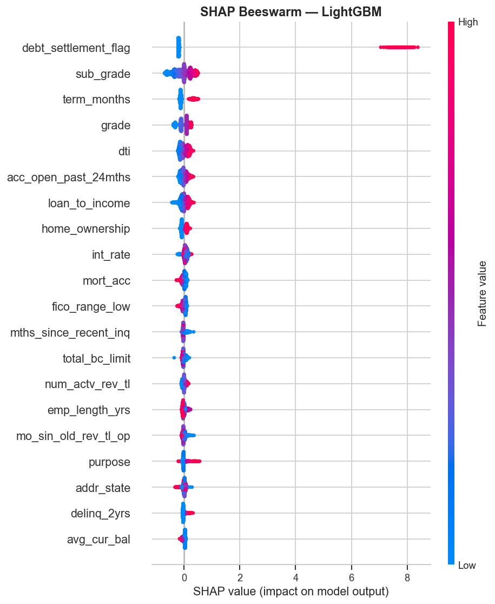

# Credit Risk Prediction — Lending Club (2007–2018)

**Predicting loan default using machine learning on 1.8M+ real loan records.**  
Tools: Python · XGBoost · LightGBM · SHAP · Pandas · Scikit-learn · Matplotlib · Seaborn

---

## Project Overview

This project builds a **credit default prediction model** on the Lending Club public dataset, replicating the core workflow of a bank's risk modeling team. The goal is to distinguish loans that will be **fully repaid** from those that will be **charged off (defaulted)**.

Inspired by my experience working on data analytics at HSBC, this project applies both classical credit risk theory (KS statistic, Gini coefficient) and modern ML interpretability (SHAP) to produce business-ready insights.

---

## Dataset

| Property | Value |
|---|---|
| Source | [Lending Club Loan Data — Kaggle](https://www.kaggle.com/datasets/wordsforthewise/lending-club) |
| Period | 2007 Q1 – 2018 Q4 |
| Raw size | ~1.8M loans, 151 features |
| After filtering | Closed loans only (Fully Paid + Charged Off) |
| Default rate | ~20% (moderate class imbalance) |

---

## Notebooks

| Notebook | Contents |
|---|---|
| [1_eda.ipynb](1_eda.ipynb) | Data loading, target definition, 9 visualizations exploring default drivers |
| [2_modeling.ipynb](2_modeling.ipynb) | Feature engineering, 3-model comparison, SHAP analysis, KS statistic |

---

## Key Results

Trained and evaluated on **1,345,310 loans** (80/20 stratified split).

| Model | ROC-AUC | Avg Precision |
|---|---|---|
| Logistic Regression (baseline) | 0.7534 | 0.5122 |
| XGBoost + Optuna | 0.7626 | 0.5257 |
| **LightGBM + Optuna** | **0.7663** | **0.5304** |

**KS Statistic (LightGBM): 0.3802** — approaches the industry benchmark of 0.40




---

## Model Selection Rationale

Three models were chosen to tell a progression story across interpretability, accuracy, and scalability:

| Model | Why chosen |
|---|---|
| **Logistic Regression** | Industry baseline for credit scoring; aligns with traditional bank scorecards and is favored by regulators for its interpretability. Establishes a performance floor. |
| **XGBoost** | Industry-standard gradient boosting for tabular data; handles missing values natively and is widely used in Kaggle credit risk competitions. Chosen to test the upper bound of tree-ensemble performance. |
| **LightGBM** | Leaf-wise splitting strategy makes it significantly faster than XGBoost on datasets >1M rows. On our 1.34M-loan dataset, it trains in a fraction of the time with comparable AUC — a critical practical advantage in production environments. |

---

## Hyperparameter Tuning

Hyperparameters for XGBoost and LightGBM were optimized using **Optuna** (Bayesian optimization with TPE sampler), rather than manual selection or grid search.

**Approach:**
- Search space: 10% stratified subsample of training data (~107K loans) for speed
- 50 trials per model, maximizing ROC-AUC on an 80/20 holdout within the subsample
- Best parameters then applied to retrain on the **full 1.07M-loan training set**

**Parameters tuned:** `n_estimators`, `max_depth`, `learning_rate`, `subsample`, `colsample_bytree`, `reg_alpha`, `reg_lambda`, plus model-specific params (`min_child_weight`, `gamma` for XGBoost; `num_leaves`, `min_child_samples` for LightGBM).

This approach reflects real-world ML workflows where full-data grid search is computationally prohibitive.

---

## Feature Engineering Highlights

- **`loan_to_income`** — loan amount relative to annual income (leverage indicator)
- **`installment_to_income`** — monthly payment burden (cash flow stress)
- **`credit_history_months`** — months from earliest credit line to issue date
- **`emp_length_yrs`** — numeric employment length parsed from text
- Dropped: target-leakage post-origination columns, joint application fields (>80% missing), free-text fields

---

## SHAP Insights (Business Interpretation)

Top default drivers identified via SHAP:

1. **Interest rate** — strongest single predictor; reflects both risk pricing and borrower quality
2. **FICO score** — protective; higher score → lower default probability
3. **Debt-to-Income (DTI)** — positive effect on default; consistent with economic theory on household leverage
4. **Loan purpose** — small business and renewable energy carry above-average risk
5. **Credit history length** — longer history is protective (selection effect)

These align with **Basel II credit risk weights** and **Altman Z-score** factors — demonstrating economic reasoning, not just model tuning.

---

## Methodology

```
Raw Data (1.8M rows, 151 features)
    ↓ Filter closed loans → 1,345,310 loans
    ↓ Drop leakage + >50% missing cols
    ↓ Feature engineering (71 features total, 5 engineered)
    ↓ Label encode categoricals
    ↓ Train/Test split (80/20, stratified)
    ↓
Logistic Regression → baseline AUC
XGBoost (scale_pos_weight, early stopping)
LightGBM (class_weight='balanced')
    ↓
SHAP TreeExplainer → global + local explanations
KS Statistic → banking-standard separation metric
```

---

## How to Run

```bash
# 1. Clone the repo
git clone https://github.com/proverb27515/credit-risk-lending-club.git
cd credit-risk-lending-club

# 2. Create a virtual environment and install dependencies
python -m venv .venv
source .venv/bin/activate
pip install -r requirements.txt

# 3. Download dataset from Kaggle and place in project root
#    File: accepted_2007_to_2018Q4.csv.gz

# 4. Run notebooks in order
jupyter notebook
```

---

## Skills Demonstrated

`Machine Learning` · `Credit Risk Modeling` · `Feature Engineering` · `Class Imbalance Handling` · `SHAP Interpretability` · `Financial Domain Knowledge` · `Data Visualization` · `Python (Pandas, Scikit-learn, XGBoost, LightGBM)`

---

*Dataset is from Lending Club's public loan data. This project is for portfolio and educational purposes.*
