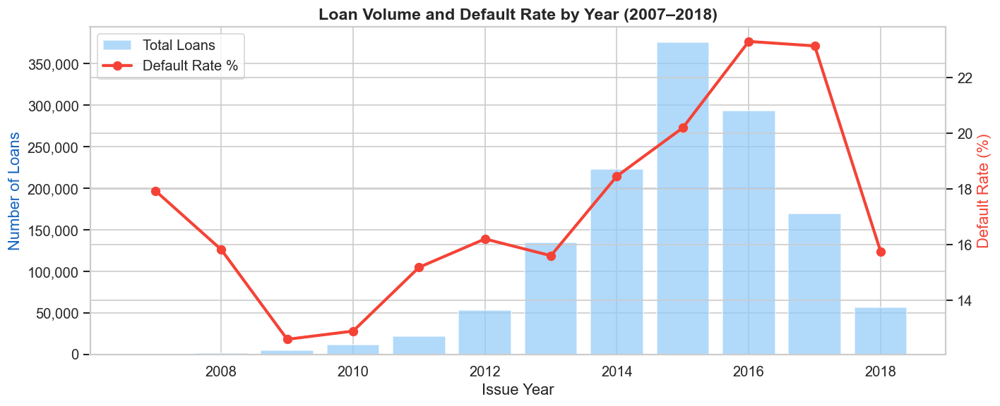
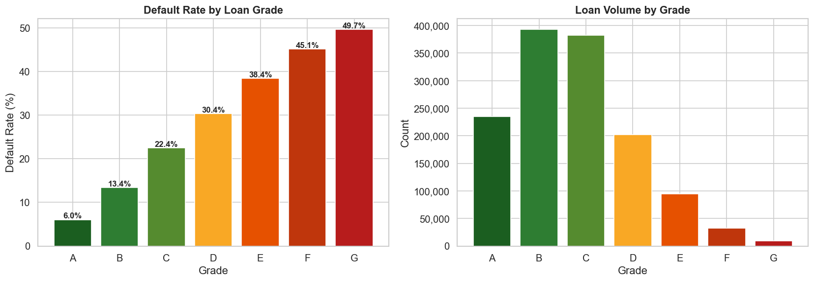
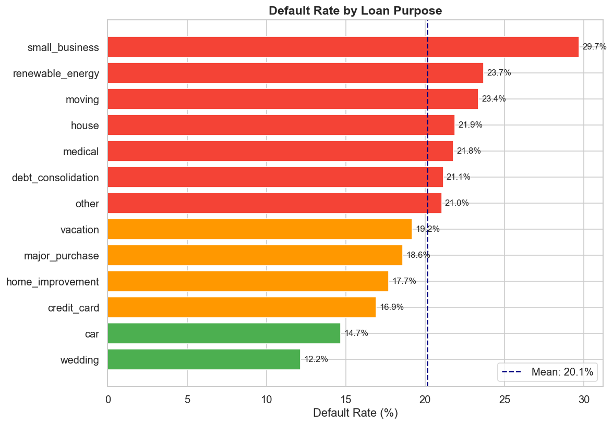
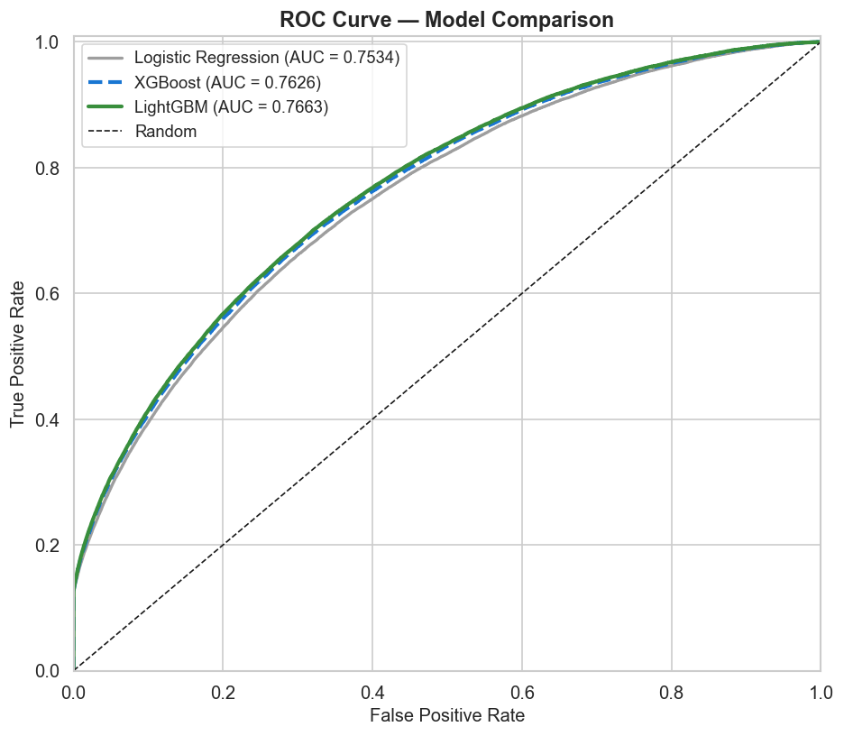
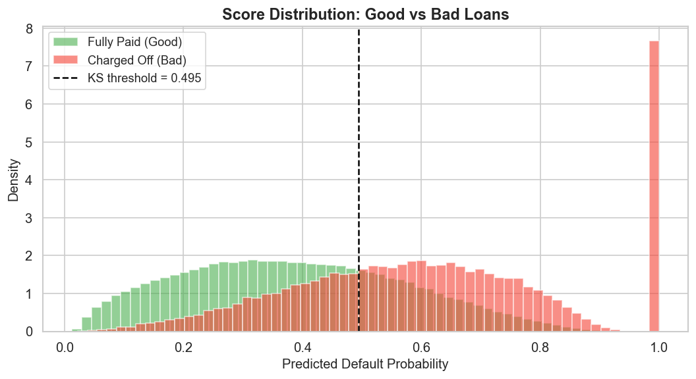
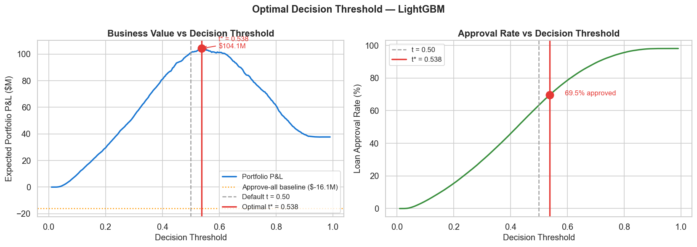
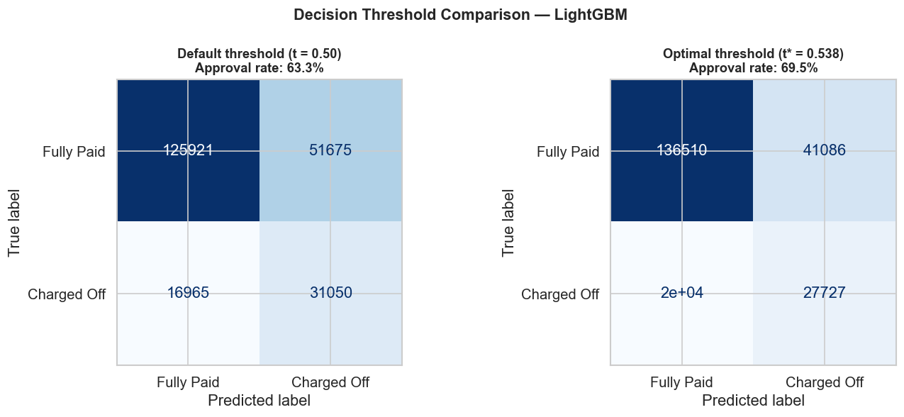
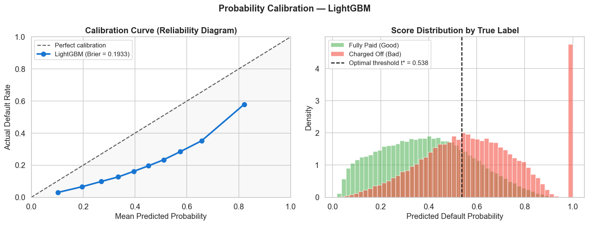
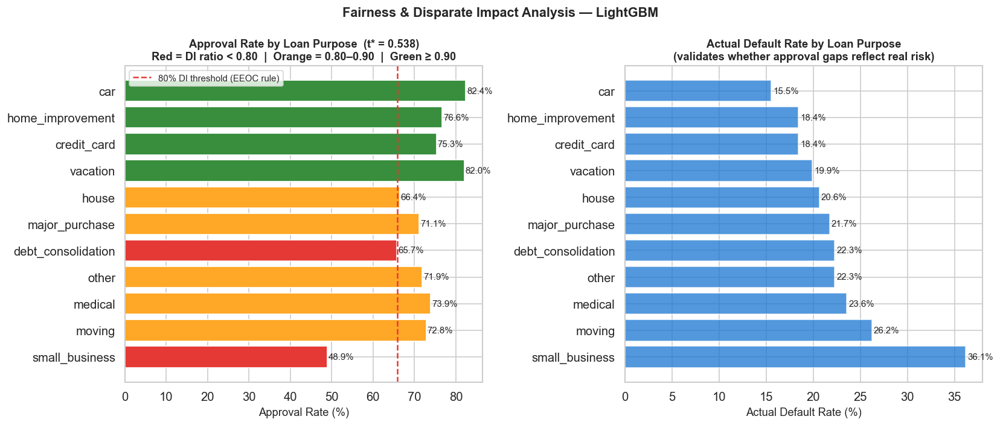
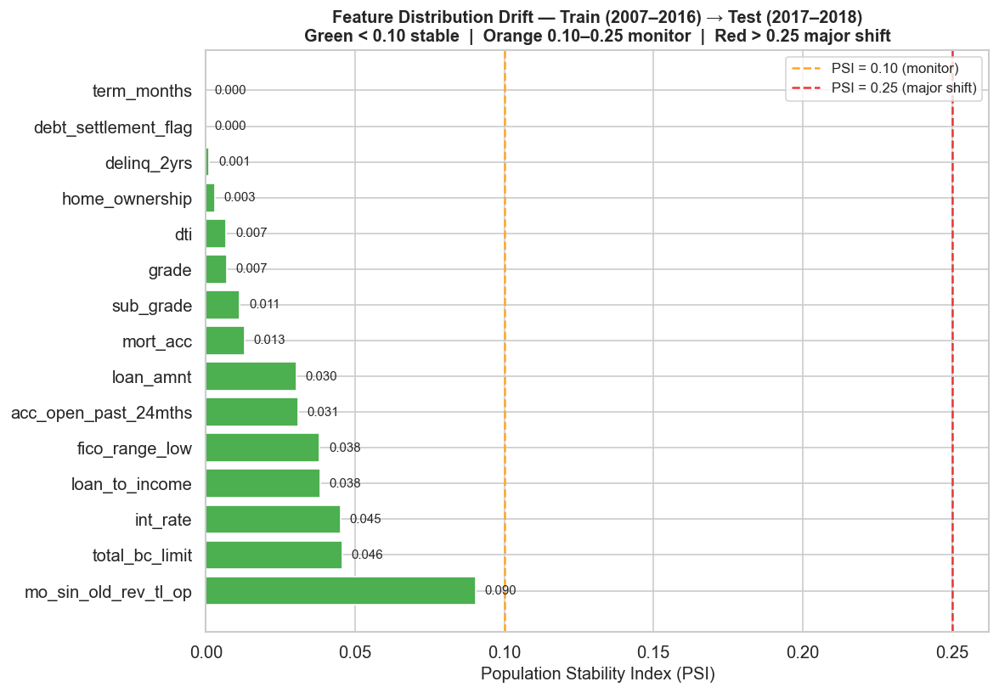

# Credit Portfolio Analytics - Lending Club (2007-2018)

Data analytics project for consumer lending risk, portfolio policy, and underwriting decision support using **1.34M Lending Club loans**.

**Stack**: Python · Pandas · Scikit-learn · LightGBM · SHAP · Streamlit · Matplotlib · Jupyter

[](https://proverb27515-credit-risk.streamlit.app/)

---

## Executive Summary

This project answers a practical lending question:

> Which borrowers should a marketplace lender approve, decline, or monitor to improve portfolio profit while controlling default risk?

Using Lending Club loans originated from 2007-2018, I built an analyst workflow that combines EDA, segment analysis, out-of-time validation, policy-threshold testing, fairness checks, and portfolio monitoring.

The modeling component is used as a **decision-support tool**, not as the whole project. The main deliverable is an analytics framework that translates borrower risk scores into business actions.

---

## Key Findings

Results are measured on a 2017-2018 out-of-time holdout of **225,611 loans**:

| Question | Finding | Business Use |
|---|---:|---|
| How risky is the portfolio? | Holdout default rate: **21.3%** | Sets baseline loss expectation |
| Does the score rank risk reliably? | LightGBM ROC-AUC: **0.7505**, KS: **0.3571** | Supports rank-based underwriting decisions |
| What policy threshold maximizes value? | **t = 0.538** produced **$104.1M** portfolio P&L | Converts score into approval policy |
| What if we approved everyone? | Approve-all P&L: **-$16.1M** | Shows downside of no risk screen |
| Where should policy teams monitor? | `small_business` and `debt_consolidation` need closer review | Segment-level risk and fairness monitoring |

**Bottom line:** a risk-based approval policy improved expected P&L by **$120.2M vs. approve-all** on the 2017-2018 cohort, while keeping the workflow auditable through segment analysis, calibration review, and drift monitoring.

---

## Interactive Analytics Dashboard

**[Live Streamlit dashboard](https://proverb27515-credit-risk.streamlit.app/)**.

The app is framed for analyst use cases:

- Portfolio KPI snapshot for the out-of-time holdout
- Application-level approval decision under the selected policy threshold
- Policy-threshold comparison against approve-all and default 0.50 cutoff
- Segment risk and fairness monitoring table
- Feature-drift and calibration notes for model governance

Run locally:

```bash
git clone https://github.com/proverb27515/credit_risk_lending.git
cd credit_risk_lending
pip install -r requirements.txt
streamlit run app.py
```

---

## Business Problem

Marketplace lenders need to balance two competing goals:

1. Approve enough loans to preserve growth and interest revenue
2. Avoid approving borrowers whose expected default loss exceeds expected return

Static approval rules can miss within-grade borrower differences. A pure prediction exercise also falls short because a probability score is not a business decision. This project connects the two:

```text
Borrower and loan data
    -> risk segmentation
    -> default score
    -> approval threshold
    -> portfolio P&L
    -> monitoring plan
```

The project uses only pre-origination fields available at application time. Post-disbursement payment fields were removed to avoid leakage.

---

## Dataset

| Property | Value |
|---|---|
| Source | [Lending Club Loan Data - Kaggle](https://www.kaggle.com/datasets/wordsforthewise/lending-club) |
| Period | 2007 Q1 - 2018 Q4 |
| Raw data | ~1.8M loans, 151 columns |
| Modeling sample | **1,348,059** closed loans: Fully Paid or Charged Off |
| Target | `1` = Charged Off, `0` = Fully Paid |
| Overall default rate | **19.98%** |
| Validation design | Train on 2007-2016, test on 2017-2018 |

The temporal split matters because lending portfolios change with macro conditions, underwriting policy, and borrower mix. A random split would make the project look stronger on paper but less credible for real portfolio analysis.

---

## Analytics Workflow

```text
1. Data quality and leakage review
   - Keep only closed loans
   - Remove payment-history, recovery, and post-origination variables
   - Drop fields with excessive missingness and free-text identifiers

2. Exploratory analysis
   - Default rate over time
   - Default rate by grade, purpose, home ownership, income, and DTI
   - Missing-value and correlation review

3. Feature preparation
   - Loan-to-income ratio
   - Installment-to-income ratio
   - Credit history length
   - Employment length
   - Loan term in months

4. Score development and validation
   - Logistic regression baseline
   - Tree-based model comparison
   - Out-of-time validation on 2017-2018 loans

5. Business decisioning
   - Threshold sweep
   - Expected P&L comparison
   - Approval-rate tradeoff

6. Governance checks
   - Calibration review
   - Segment fairness screen using the EEOC 80% rule
   - Feature drift monitoring using PSI
```

---

## EDA Highlights

### Default Rate Over Time



Observed default rates are affected by vintage maturity. Earlier cohorts are more fully seasoned, while some 2016-2018 loans were still active at the dataset cutoff. I therefore treat late-vintage results cautiously and validate on a clean out-of-time window rather than relying on random-split metrics.

### Credit Grade Separates Risk, But Not Enough



Lending Club grades rank default risk clearly, from low-risk Grade A borrowers to high-risk Grade G borrowers. However, there is still material within-grade variation, which creates an opportunity for borrower-level underwriting analytics.

### Loan Purpose Reveals Segment-Level Risk



Small-business loans show the highest default risk, while credit-card refinancing is lower risk. This matters for both portfolio concentration monitoring and policy review: approval thresholds should be evaluated by segment, not only at the portfolio level.

---

## Model Validation

The model is included to support scoring and decisioning, but the project evaluation focuses on whether the score is useful for portfolio action.

| Model | ROC-AUC | Average Precision |
|---|---:|---:|
| Logistic Regression baseline | 0.7334 | 0.4772 |
| XGBoost | 0.7496 | 0.5030 |
| **LightGBM** | **0.7505** | **0.5045** |

**KS statistic:** 0.3571

Interpretation:

- The score ranks borrowers meaningfully on future-originated loans.
- The uplift from logistic regression confirms that non-linear relationships add value.
- LightGBM and XGBoost perform similarly, so the final app uses LightGBM for speed and deployment simplicity.
- The public dataset lacks bureau tradelines, bank transaction history, and employment verification, so the result should be interpreted as a strong public-data benchmark rather than an institutional production scorecard.





---

## Business Decisioning

### Threshold Optimization

A default score becomes useful only when it is translated into an approval policy. I compared approval strategies using expected portfolio P&L on the 2017-2018 holdout.

| Policy | Portfolio P&L | Approval Rate |
|---|---:|---:|
| Approve all | **-$16.1M** | 100.0% |
| Default threshold 0.50 | **$101.1M** | ~75.0% |
| Optimized threshold 0.538 | **$104.1M** | 69.5% |

The optimized threshold adds **$3.0M** over the default 0.50 cutoff and **$120.2M** over approve-all. This is the key analyst conclusion: the value comes from choosing the right operating policy, not simply from training a model.





### Calibration Review



The score ranks borrowers well, but raw predicted probabilities are inflated because the model uses class weighting. That makes the score suitable for rank-ordering and threshold decisions, but not ready for direct risk-based pricing without calibration.

| Metric | Value | Meaning |
|---|---:|---|
| Brier Score | 0.1933 | Probability forecast error |
| Naive baseline | 0.1675 | Always predicting base rate |
| Brier Skill Score | -0.15 | Raw probabilities need calibration |

---

## Segment Monitoring

### Fairness and Disparate Impact Screen



| Purpose | Approval Rate | Default Rate | DI Ratio | Analyst Takeaway |
|---|---:|---:|---:|---|
| car | 82.4% | 15.5% | 1.00 | Low risk, high approval |
| credit_card | 75.3% | 18.4% | 0.91 | Within acceptable range |
| debt_consolidation | 65.7% | 22.3% | 0.80 | Borderline; monitor |
| small_business | 48.9% | 36.1% | 0.59 | Lower approval appears risk-driven, but needs review |

`small_business` falls below the 0.80 disparate-impact screen, but its observed default rate is also substantially higher than the portfolio average. In a real lending environment, this would trigger a deeper fair-lending review using protected-class data or approved proxy methodology.

### Feature Drift



The top score drivers showed PSI below 0.10 between training and holdout windows, suggesting stable feature distributions. The remaining performance gap is more likely tied to credit-cycle and vintage effects than to severe input drift.

---

## Deliverables

| File | Purpose |
|---|---|
| `1_eda.ipynb` | Data cleaning, leakage review, EDA, and visualizations |
| `2_modeling.ipynb` | Feature engineering, model comparison, validation, threshold analysis, and monitoring checks |
| `app.py` | Streamlit analytics dashboard for decision support |
| `fig_*.png` | Portfolio, segment, validation, and governance visuals |
| `lgbm_model.pkl` and support `.pkl` files | Pre-trained scoring artifacts used by the dashboard |

---

## Limitations

| Limitation | Why It Matters |
|---|---|
| Public data only | Missing bureau-level and transaction-level features limits institutional accuracy |
| Calibration gap | Raw probabilities should not be used directly for pricing without Platt scaling or isotonic calibration |
| Vintage truncation | Some late-originated loans were not fully seasoned by the dataset cutoff |
| Fairness proxy | Loan purpose is not a protected class; a full audit needs compliant protected-class analysis |
| Platform specificity | Lending Club marketplace behavior may differ from bank underwriting portfolios |

---

## Skills Demonstrated

`Data Analysis` · `Credit Risk Analytics` · `Portfolio KPI Design` · `Policy Threshold Analysis` · `Segment Analysis` · `EDA` · `Data Cleaning` · `Feature Engineering` · `Out-of-Time Validation` · `Model Evaluation` · `Fair Lending Monitoring` · `Population Stability Index` · `Calibration Review` · `Dashboarding` · `Python` · `Pandas` · `Scikit-learn` · `LightGBM` · `Streamlit` · `Matplotlib`
